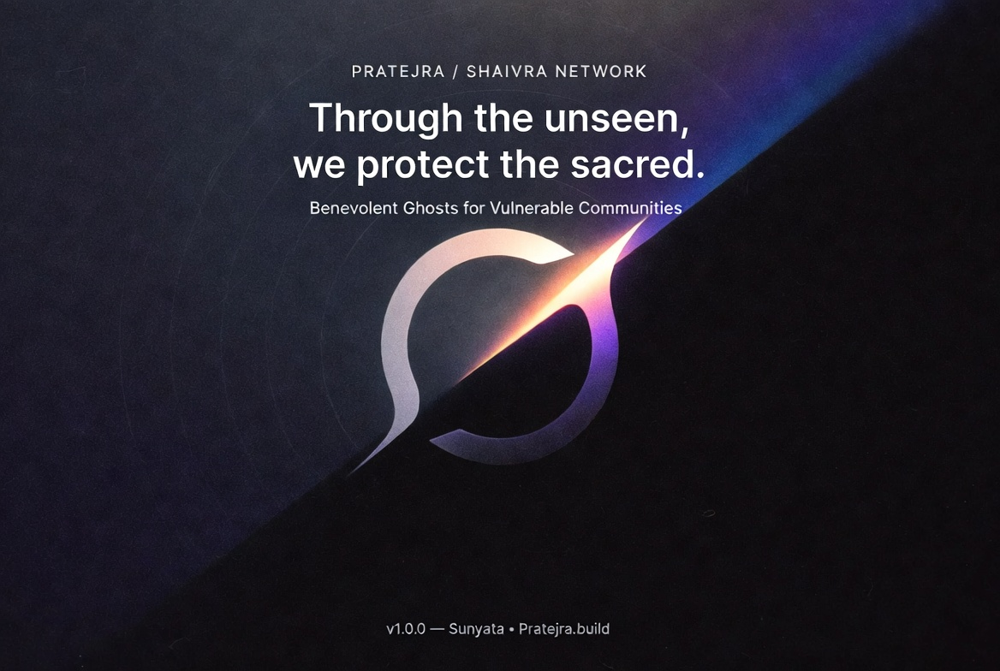

  

# 🕯️ PRINCIPLES OF PRATEJRA TECH

  

---

## 1. Core Mission 🌱🛡️

We exist to **protect the vulnerable** and **empower aligned communities** — especially children, families, and all those threatened by authoritarian, extractive, or abusive forces.

**Our approach is:**

- 🏆 **Value-driven** — guided by integrity, not profit  
- 🛡️ **Protective** — never exploitative  
- 🛠️ **Constructive** — genuine efforts, not empty gestures  

> 💡 _Material gain is always secondary: our truest calling is spiritual growth and the real flourishing of lasting communities._

---

## 2. Brand Essence: The Dance of Light & Shadow ✨🌑

  

**Pratejra (The Light)**  
A still, radiant force that brings protection and insight to the vulnerable.

**Shaivra (The Shadow)**  
The unseen guardian—disciplined, prepared, and strategically resolute against harm.

Together, they form a **veil between worlds**:

- 🕉️ Ancient spiritual discipline  
- 🤖 Modern intelligence-grade craft  
- ⚔️ The essential paradox: both the light and the shadow at play for true impact  

> 🔮 “From stillness, Pratejra strikes.  
> From silence, Shaivra shapes.”

---

## 3. The Benevolent Ghosts 👻✨

We live and serve as **Benevolent Ghosts**:

- 🫥 **Invisible, yet impactful** — presence that changes the room, not the headlines  
- 🧭 **Bound by code** — wisdom, compassion, discretion, and precision  
- 🚫 **Never for profit or power** — all action must elevate life, truth, and dignity  

Benevolent Ghosts operate through:

- 🖥️ Digital firewalls  
- 🕵️‍♂️ Disinformation campaigns  
- 🏛️ Bureaucratic and oppressive structures  

…while staying anchored in **ancient wisdom** and **right action**.

---

## 4. Mission Objectives 🎯

1. 🛡️ **Humanitarian Protection**  
   Defend at-risk communities — physically, psychologically, digitally, and informatively.

2. 🏺 **Preservation of Heritage**  
   Safeguard cultural, historical, spiritual, and environmental treasures.

3. 💥 **Counter Exploitation**  
   Expose and disrupt systems of corruption, oppression, and exploitation.

4. 🔗 **Empower the Aligned**  
   Provide tools and advantages to those who share our ethics but lack resources.

---

## 5. Core Values 🌸

- 💖 **Benevolence Before All**  
  Every decision must honor life, truth, dignity, and compassion.

- 🎯 **Precision Over Noise**  
  Take the right step at the right time—quietly and calmly.

- 🤝 **Consent & Secrecy**  
  Power is nothing without accountability. We act transparently, never unilaterally.

- 🦉 **Security as Discernment**  
  We are protected by vigilance, caution, and clarity.

- 🕰️ **Wisdom Before Speed**  
  Decisive, never rash. “Slow is smooth; smooth is fast.”

---

## 6. Operational Alignment 🌀

Our craft merges **timeless wisdom** with **AI-powered intelligence**.

Every mission respects three operational principles:

1. 🛡️ **The Circle of Protection**  
   Does this shield, uplift, or preserve? If unsure, we abstain.

2. 🥷 **The Ghost Step**  
   Move quietly. Discretion shields both us and those we serve.

3. 🪞 **The Mirror of Truth**  
   Internal ethical reflection before major action. Alignment validated before engagement.

---

## 7. Technology & Tools 🖥️🛠️

Technology is our servant, never our master.

We utilize a **layered tech ecosystem** to protect, never dominate:

- 🔐 **Operational Security**  
  Encryption, zero-trust models, sovereign hosting, and cautious data practices.

- 🤖 **Intelligence & Automation**  
  AI agents and data tools that:  
    - Detect harmful patterns  
    - Strengthen aligned organizations  
    - Improve resilience and situational awareness  

> ⚠️ _Our tools must never be turned against those we vow to protect._

---

## 8. Community & Alignment 🌐

We don't **recruit**—we **recognize** those already in tune.

To all moving with discipline, compassion, and precision:  
**We are your silent ally.**

To those who exploit or distort truth:  
**We are the shadow at your back.**

  

---

## 9. Consulting & Engagements 💼

Every engagement—consulting, advisory, or technical—must:

- 🎯 Advance a truly benevolent purpose  
- 🚫 Never strengthen systems of exploitation or harm  
- 🛡️ Protect privacy, autonomy, and dignity  
- 📜 Uphold every principle outlined here—non-negotiable

Short, high-impact collaborations are always favored over entangling, long-term arrangements.

---

## 10. Mantra (Incantation) 🧘

For alignment, invocation, and remembrance:

> **“From stillness, Pratejra strikes.  
> From silence, Shaivra shapes.”** ✨🌑

**Optional Sanskrit:**  
> **“Shaantāt hanti, maunāt srujati. Shaivraḥ.”**  
> _From peace, slay; from silence, create._

---

## 11. Stewardship & Spirit 🌱🕊️

This doctrine is **living, shared, and stewarded in common**.

It is entrusted to all who carry our mission forward in good faith.

**Version:** `v1.0.0 — Authored by Sunyata`  
**License of Spirit:** Use, adapt, and extend *only* in service to life, dignity, and truth.

  

